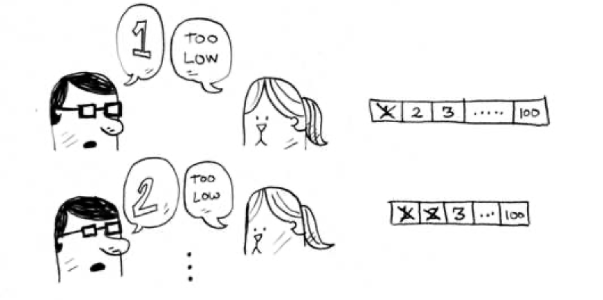
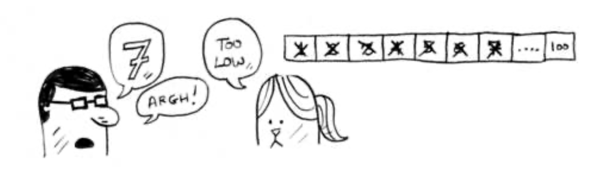
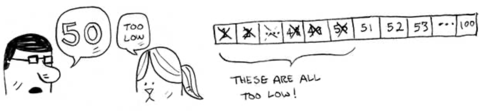
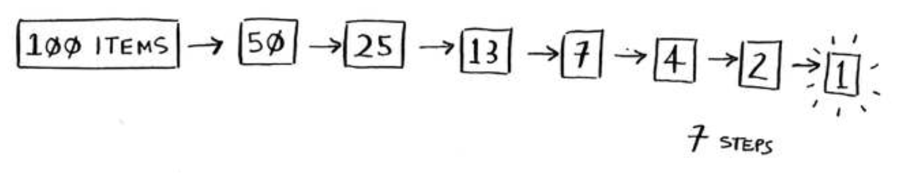
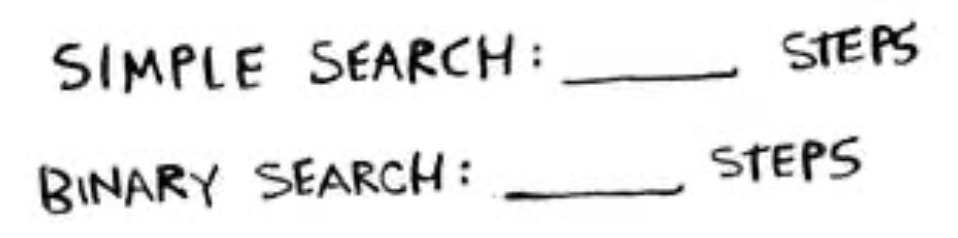
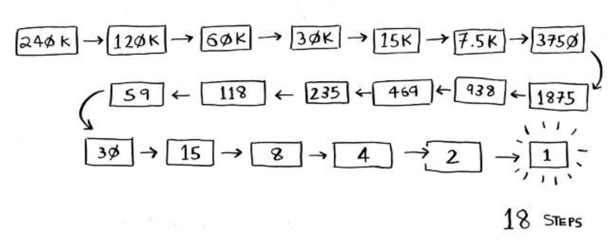

# Binary Search
> Basitce `Binary Search`, kendisine geçilen sıralı bir listenin içerisinde aramak istenilen `X` değerini bulmak için verilen listeyi ortadan ikiye böler ve bölünen değeri `X` değeri ile karşılaştırır. `X` bölünen liste değerinden küçükse, listenin sol yarısını arar, büyükse listenin sağ yarısını arar. Daha sonra sol ve sağ yarıları alt listeler şeklinde ele alarak bu işlemi tekrarlar. `X` yine bu alt listelerin orta noktasıyla karşılaştırılır ve sonra ya sol ya da sağ tarafında arama yapılır. Bu işlemi ya `X` bulana kadar ya da alt listenin boyutu `0` olana kadar tekrarlanır.

\
`Binary Search`'nın nasıl çalıştığını anlamak için bir örnek. 

1 ile 100 arasında belirlenen bir sayıyı bulmanız isteniyor. Mümkün olan en az denemede sayıyı tahmin etmeye çalışmalısınız. Her tahminde, tahmininizin çok düşük, çok yüksek veya doğru olup olmadığı size söyleniyor.

Diyelimki tahmin etmeye şu şekilde başlıyorsunuz: 1, 2, 3, 4 ... ve böyle devam ediyorsunuz.

Bu basit bir arama. Her tahminde yalnızca bir sayıyı eliyorsunuz. 99 sayısı için 99 tahminde bulunmanız gerekirdi!

### **Bulmak için daha iyi bir yol**
İşte daha iyi bir teknik. 50 ile başlamayı deneyin.

Çok düşük, ama sayıların yarısını elersiniz! Artık 1–50'nin çok düşük olduğunu biliyorsunuz. Sonraki tahmininiz: 75.

Çok yüksek, ama yine de kalan sayıların yarısını elediniz! İkili arama ile her seferinde orta sayıyı tahmin edersiniz ve kalan sayıların yarısını ortadan kaldırırsınız. Sonraki 63 (50 ile 75 arasında).

Bu ikili aramadır. İlk algoritmanızı öğrendiniz! İşte her seferinde kaç sayı eleyebilirsiniz.

Sayı ne olursa olsun, en fazla yedi tahminde bulunabilirsiniz çünkü her tahminle birçok sayıyı elemiş olursunuz!

Sözlükte bir kelime aradığınızı varsayalım. Sözlükte 240.000 kelime var. En kötü durumda, her bir aramanın kaç adım atacağını düşünüyorsunuz?

Aradığınız kelime kitaptaki son kelime ise, `Simple Search` 240.000 adım atabilir. `Binary Search`'nın her bir adımında, izin verdiğiniz tek bir kelimeyle sözcük sayısını yarıya kadar düşürürsünüz .

Yani `Binary Search` 18 adım alacaktır - büyük bir fark! Genel olarak, `n`'nin herhangi bir listesi için, `Binary Search`'yı en kötü durumda çalıştırmak `log2 n` adımlarını alırken, `Simple Search` `n` adımını alacaktır.